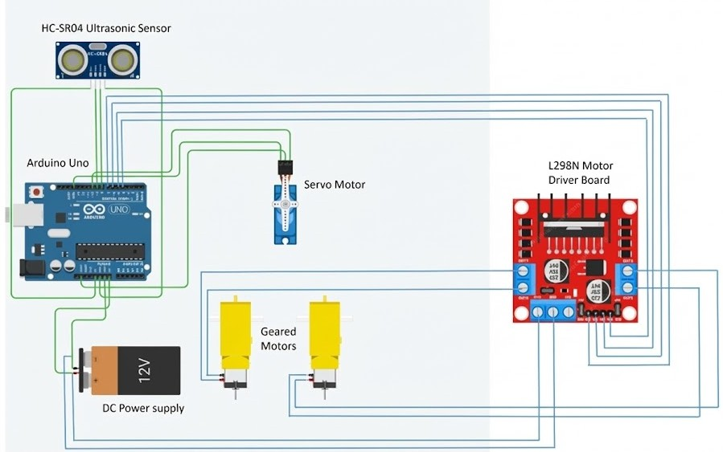

# Design Document — Arduino-Based Obstacle Solver Robot

**BRAC University — CSE-350 (Project Demo-1)**

**Team:** Sabiq Zahid (22201283) · Imtiaz Salam Jami (21301649) · Md. Nabil Mohtashim (22201281)

> This is the detailed design write-up produced during development, when the
> robot was still built on an **Arduino Uno**. Partway through the project the
> Uno's Vin pin was damaged and the build moved to an **ESP32** for the final
> submission — see [`PROJECT_REPORT.md`](./PROJECT_REPORT.md) for the as-built,
> as-tested version. This document is kept because it contains the fullest
> explanation of the sensing, servo-scanning, and motor-control design, all of
> which carried over conceptually to the final build.

## Table of Contents

- [Summary](#summary)
- [Implementation](#implementation)
  - [Theoretical Foundation](#theoretical-foundation)
  - [System Architecture and Circuit Design](#system-architecture-and-circuit-design)
  - [Component Specification (BOM)](#component-specification-bom)
  - [Circuit Diagram](#circuit-diagram)
  - [Software Implementation](#software-implementation)
  - [Calibration and Testing Methodology](#calibration-and-testing-methodology)
  - [Implementation Challenges and Solutions](#implementation-challenges-and-solutions)
- [Conclusion](#conclusion)
- [Future Improvements and Extensions](#future-improvements-and-extensions)

## Summary

This project is the design and implementation of an autonomous obstacle-avoiding
robot built on the Arduino Uno platform, meant to demonstrate embedded systems,
autonomous navigation, and real-time decision-making in mobile robotics. A single
ultrasonic distance sensor (HC-SR04) mounted at the front detects obstacles
through acoustic ranging, enabling dynamic obstacle avoidance in unknown
environments.

The goal was a cost-effective, reliable autonomous system that navigates around
obstacles without human intervention. When an obstacle is detected within a
predefined threshold distance, the robot autonomously changes direction toward
a clear path — treating obstacles the way a maze-solving robot treats walls,
and making all decisions from proximity measurements alone. Motor control runs
through an L298N dual H-bridge driver, giving directional control and speed
modulation via PWM. Power comes from a 7.4V LiPo battery, with onboard voltage
regulation supplying a stable 5V logic rail to the sensors and control circuits.

## Implementation

### Theoretical Foundation

The obstacle-avoidance approach is based on ultrasonic distance measurement and
dynamic path selection: the robot continuously moves forward while periodically
measuring the distance to objects ahead, and executes an avoidance maneuver
whenever that distance drops below a critical threshold.

#### Ultrasonic Sensing Principles

The HC-SR04 measures distance by transmitting a short ultrasonic pulse and
timing how long the echo takes to return after reflecting off an obstacle:

```
Distance (cm) = (Time × Speed of Sound) / 2
```

The speed of sound in air is taken as ~343 m/s (0.034 cm/µs); dividing by 2
accounts for the round trip. In practice the sensor:

1. Receives a 10 µs HIGH pulse on the trigger pin
2. Emits an 8-cycle ultrasonic burst automatically
3. Generates a HIGH pulse on the echo pin, with duration proportional to
   time-of-flight
4. Supports an effective range of 2–400 cm at roughly ±3 mm accuracy

#### Servo-Based Scanning Mechanism

To get directional awareness beyond straight-ahead detection, the ultrasonic
sensor sits on a servo motor, turning it into a small scanning sonar. The servo
sweeps to three discrete positions:

| Position | Angle | Purpose |
|---|---|---|
| Center | 90° | Forward-facing, continuous path monitoring while driving |
| Right | 0° | Scans for obstacles on the right |
| Left | 180° | Scans for obstacles on the left |

When an obstacle appears ahead, the robot stops, scans right, returns to
center, then scans left. Comparing the two side readings tells it which
direction has more clearance.

#### Motor Control and Differential Drive

Two independently driven wheels handle both linear and rotational motion. The
L298N H-bridge reverses current polarity to each DC motor for bidirectional
control, and turning is achieved through differential wheel speeds:

- **Forward:** both motors spin forward at equal speed
- **Right turn:** left motor forward, right motor reverse (or stopped) — clockwise rotation
- **Left turn:** right motor forward, left motor reverse (or stopped) — counter-clockwise rotation

This lets the robot rotate in place (zero turning radius) for precise
direction changes in tight spaces.

### System Architecture and Circuit Design

**Power distribution.** A 7.4V 2S LiPo battery is the primary source, feeding
the L298N's high-voltage input directly to drive the DC geared motors. The
same battery feeds the Arduino Uno's 5V pin; the Uno's regulated 5V output in
turn powers the L298N logic (VCC) and the ultrasonic sensor, keeping logic
levels consistent across the system. A common ground bus ties together the
battery negative, Arduino GND, L298N ground, and sensor ground to avoid
ground loops.

**Control signals.** The Arduino Uno drives the L298N and sensor subsystem
over seven digital I/O pins:

| Pin | Role |
|---|---|
| D7, D6 | IN1, IN2 — Motor 1 (left) direction |
| D5, D4 | IN3, IN4 — Motor 2 (right) direction |
| D8 | Trigger (output) — 10 µs pulse to start each ultrasonic burst |
| D9 | Echo (input) — pulse width proportional to distance |
| D10 | Servo control (PWM via the Arduino `Servo` library) |

Motor direction logic:
- `IN1=HIGH, IN2=LOW` → Motor 1 (left) forward
- `IN3=LOW, IN4=HIGH` → Motor 2 (right) forward
- Reversing either pair reverses that motor, for turning

`servo.write()` positions the servo at 0° (right), 90° (center), or 180°
(left) to aim the ultrasonic sensor during a scan.

### Component Specification (BOM)

| Component | Qty | Description & Rationale |
|---|---|---|
| Microcontroller | 1 | Arduino Uno — controls sensors and motors; provides stable 5V logic |
| Motor Driver | 1 | L298N — motor direction/speed control; compatible with the Uno's 5V logic |
| Sensor | 1 | HC-SR04 ultrasonic sonar — detects walls/obstacles via acoustic ranging |
| Motors | 2 | DC geared motors — low-RPM (e.g. 60 RPM) for controllability |
| Battery | 1 | 7.4V 2S LiPo (or 9V) — powers motors directly and the Uno via VIN |
| Chassis | 1 | Robot chassis + caster wheel — should be symmetrical for balance |
| Accessories | 1 set | Jumper wires and a power switch |

Total build cost was under **$60 USD**, keeping it accessible for
educational/hobbyist use.

### Circuit Diagram

All components mount on the chassis. Wiring follows the diagram below.



### Software Implementation

The firmware is event-driven: it drives forward continuously while checking
distance on a fixed interval (non-blocking, via `millis()`), and runs a
scanning routine when an obstacle crosses the threshold.

The complete, reconstructed sketch lives at
[`firmware/maze_solver_arduino/maze_solver_arduino.ino`](../firmware/maze_solver_arduino/maze_solver_arduino.ino).
(The code pasted into the original report cut off before the motor-control
functions — they're rebuilt there from the pin logic described above, and
the sketch is annotated to show exactly what was reconstructed.)

**Algorithm logic flow:**

- **Initialization:** configure motor pins as outputs, sensor pins
  (trigger=output, echo=input), attach the servo to pin 10 and center it,
  start serial at 9600 baud, and stop the motors as a safe initial state.
- **Main loop:** check distance every 500 ms without blocking (`millis()`),
  and call `moveForward()` continuously in between.
- **Obstacle detection & scanning:** when the forward distance drops below
  15 cm — stop, sweep the servo to 0° and read `rval`, return to 90°, sweep
  to 180° and read `lval`. 700 ms delays after each servo move let it settle
  and the reading stabilize.
- **Distance measurement:** pull the trigger pin low then high for 10 µs,
  time the echo pulse with `pulseIn()`, convert via `distance = duration ×
  0.034 / 2`.
- **Motor functions:** `moveForward()` — both motors forward. `stopMotor()`
  — all pins low. `moveRight()` — left forward, right reverse. `moveLeft()`
  — left reverse, right forward.

### Calibration and Testing Methodology

**Ultrasonic sensor.** The HC-SR04 needs little calibration since it outputs
an analog distance rather than a binary threshold, but validation still
matters:
- Verify readings against known distances (10/20/30 cm, etc.) within ±3 mm
- Check the effective detection cone (~15°) — objects outside it may be
  missed, which affects corner navigation
- Confirm reliable detection down to the minimum range (2 cm)
- Test response across obstacle materials — sound-absorptive materials like
  foam can reduce effective range

**Servo motor.** Positions must line up with the intended scan directions:
- Verify with a protractor that `servo.write(0/90/180)` actually produces
  0°/90°/180°
- Mount the sensor bracket perpendicular to the servo horn so sensor
  orientation matches the commanded angle
- Tune the 700 ms settling delay against the servo's own speed and load

**Threshold distance.** The 15 cm trigger threshold trades off reaction time
against caution:
- Too low (~5 cm): not enough time to stop before collision at speed
- Too high (~30 cm): overly cautious, stops for obstacles that aren't really
  in the way
- 10–20 cm is a reasonable working range, tuned to the robot's speed and
  mechanical response time

**Timing interval.** The 500 ms distance-check interval balances
responsiveness against overhead — shorter intervals (e.g. 200 ms) react
faster but add CPU load; longer intervals (e.g. 1000 ms) may miss fast
obstacles. 500 ms gives a 2 Hz update rate, which was adequate for indoor
testing speeds.

**Validation scenarios tested:** single frontal obstacle, corner approach,
narrow corridor, and multiple successive obstacles.

### Implementation Challenges and Solutions

**1. Servo jitter and sensor stability.** Minor jitter while holding position
misaligned the sensor and produced inconsistent readings. Addressed by
ensuring adequate power supply capacity (servos can draw 500 mA+ while
moving), adding the 700 ms settling delay after each move, using a servo
with a metal gear train, and mounting it securely to cut vibration.

**2. Ultrasonic dead zones.** The ~15° detection cone leaves blind spots.
Mitigated by mounting the sensor at 5–10 cm height for better coverage and
using the servo sweep to extend effective coverage to 180° — while accepting
that very small obstacles may still fall outside the reliably detectable
range.

**3. Power supply and voltage stability.** Motor and servo current spikes
caused voltage dips that affected the Arduino and sensor readings. Addressed
with a LiPo rated for at least 2A continuous discharge, adequate wire gauge
(≥22 AWG) on motor lines, and noting separate regulators for logic vs. motor
power as a future improvement.

**4. Incomplete avoidance logic.** The code scans and stores `lval`/`rval`
but, as originally written, never compares them to actually turn. This is a
real, current gap — not just a report note — and completing it means:
comparing `lval` and `rval`, calling `moveLeft()` or `moveRight()` toward the
larger clearance, handling the case where both sides are blocked, and tuning
turn duration for a ~90° turn. It's marked as a `TODO` in the firmware file
rather than silently filled in, since it wasn't actually implemented or
tested.

**5. Serial communication interference.** Frequent `Serial.println()` calls
in the main loop added timing overhead. Mitigated by limiting debug output to
key events, and disabling serial entirely for final deployment.

**6. Distance measurement timing.** `pulseIn()` blocks execution while
waiting for the echo — acceptable for basic obstacle avoidance, but a
limitation for more advanced designs. Interrupt-driven echo measurement,
timeouts for missing echoes, and averaging multiple readings are natural
next steps.

## Conclusion

This stage of the project demonstrated a working obstacle-avoiding robot on
the Arduino Uno platform: reliable forward motion, accurate detection across
the sensor's 2–400 cm range, and functioning left/right scanning to assess
alternative paths.

**Key achievements:**
- Integrated ultrasonic ranging, servo-based scanning, embedded control, and
  motor actuation into one system
- Working dynamic obstacle-avoidance approach for maze-like environments
- Total cost under $60 USD — accessible for educational/hobbyist use
- Non-blocking timing via `millis()` for periodic distance checks without
  halting the robot
- Modular code with separate functions for motion, distance measurement, and
  scanning

**Current limitations:** the decision logic comparing `lval` and `rval` and
actually steering the robot toward clearance was never completed — the robot
scans both sides but doesn't yet act on the comparison. See the `TODO` in
[`firmware/maze_solver_arduino/maze_solver_arduino.ino`](../firmware/maze_solver_arduino/maze_solver_arduino.ino).

## Future Improvements and Extensions

- **Complete the avoidance logic** — compare `lval`/`rval` and steer
  accordingly (see the TODO above); this is the most immediately impactful
  next step
- **Multi-directional scanning** — add intermediate servo angles (45°, 135°)
  for finer-grained awareness
- **PID-based motor control** — closed-loop speed control via encoders for
  consistent turning regardless of battery voltage or surface
- **Adaptive threshold** — vary the detection threshold with environment
  density
- **Path memory / mapping** — record traversed paths and obstacles for
  smarter repeat runs
- **Multi-sensor fusion** — side/rear ultrasonic sensors for 360° awareness
- **Advanced obstacle detection** — IR or time-of-flight sensors for small or
  low-reflectivity obstacles ultrasonic may miss
- **Speed modulation** — PWM speed control via the L298N enable pins
  (ENA/ENB)
- **Wireless telemetry** — Bluetooth (HC-05) or Wi-Fi (ESP8266/ESP32) for
  live monitoring and manual override
- **Machine learning** — use collected navigation data to optimize
  pathfinding over time
- **Obstacle classification** — combine ultrasonic + IR to estimate
  obstacle size/material for context-aware decisions

These would take the project from proof-of-concept toward something usable
for micromouse-style competitions, further coursework, or as a base for more
capable robotics projects.

---

*Acknowledgments: the authors thank BRAC University and the CSE-350 course
instructors for the resources and guidance behind this project.*
