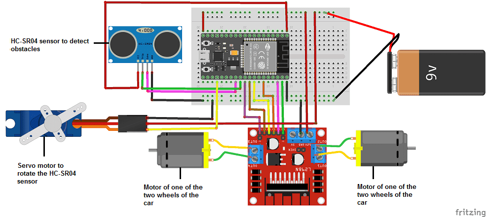
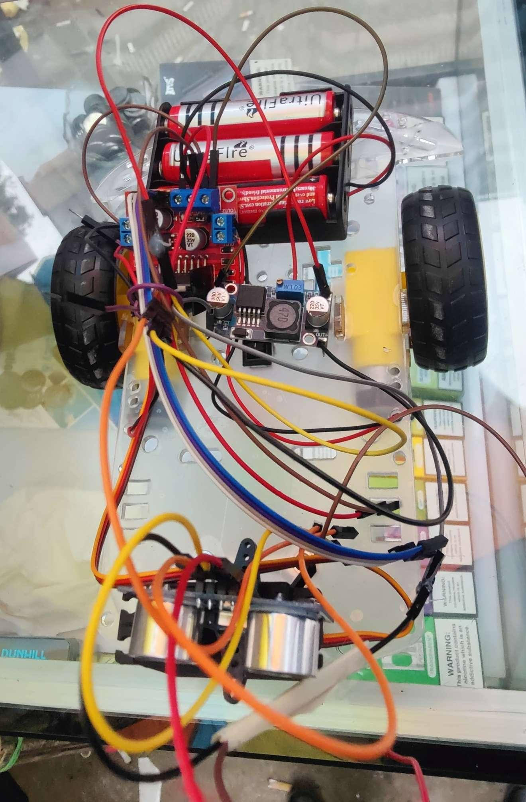

# Design and Implementation of a Maze Obstacle Avoidance Robot using ESP32 Architecture

**Authors:** Sabiq Zahid (22201283) · Sayed Imtiaz Salam Jami (21301649) · Md. Nabil Mohtashim (22201281)
**Department of Computer Science and Engineering, BRAC University, Dhaka, Bangladesh**

> This is the final, as-built and as-tested version of the project, adapted
> from the submitted IEEE-format paper. It supersedes the Arduino-based
> design in [`DESIGN_DOCUMENT.md`](./DESIGN_DOCUMENT.md) — the build moved to
> an ESP32 after the original Arduino Uno's Vin pin was damaged (see
> [Challenges and Solutions](#challenges-and-solutions)).

## Abstract

This paper presents the design and implementation of a maze obstacle
avoidance robot capable of navigating an unknown maze autonomously. The robot
uses ultrasonic sensors to detect walls and obstacles, and a simple
decision-making algorithm to choose an appropriate path toward its
destination.

**Keywords:** maze solver robot, ESP32 microcontroller, ultrasonic sonar
sensors, obstacle detection

## Table of Contents

- [Introduction](#introduction)
- [System Design](#system-design)
- [Implementation](#implementation)
- [Challenges and Solutions](#challenges-and-solutions)
- [Conclusion](#conclusion)
- [Future Work](#future-work)
- [References](#references)

## Introduction

Autonomous robots are increasingly used in industrial automation, healthcare,
and education. Maze solving is one of the most common applications of
autonomous robotics: a robot must navigate an unknown environment to reach a
target location, and maze-solver robots are a popular beginner project for
learning sensors, microcontrollers, and control algorithms.

When an obstacle is detected within a predefined threshold distance, the
robot autonomously executes an avoidance maneuver by changing direction
toward a clear path. This lets it treat obstacles as maze walls and make all
navigation decisions from proximity measurements alone. Motor control runs
through an L298N dual H-bridge driver. The system is powered by an 11.1V
lithium battery, with onboard voltage regulation supplying a stable 5V logic
rail to the sensors and control circuits.

This paper covers the development of a low-cost, ESP32-based maze solver
robot for educational use.

## System Design

### Hardware Components

- ESP32 microcontroller
- HC-SR04 ultrasonic sonar sensor (front-mounted, for obstacle detection)
- L298N motor driver module
- 2× DC motors
- 1× servo motor (rotates the ultrasonic sensor)
- Buck converter
- 2× wheels, 1× chassis, 1× switch
- 3.7V battery supply (×3)

### Software Design

The ESP32 is programmed in C++ using the Arduino framework. The main loop
continuously reads the ultrasonic sensor and controls motor direction and
speed. Navigation follows a simple **left-hand rule**: the robot is coded to
prefer a left turn over a right turn when both are viable, and it reads and
reacts to sensor values continuously to adjust its movement.

## Implementation

### Theoretical Background

The robot starts moving forward when the switch is turned on. The ultrasonic
sonar sensor detects walls or obstacles by sending out ultrasonic waves, and
the system calculates a distance threshold (as an integer) used to decide
when to stop for a collision or continue moving.

### Work Flow

The ultrasonic sensor detects the presence of walls, and the robot stops to
calculate distance and scope for movement. The ESP32 processes the sensor
data and drives the motors accordingly; the motor driver controls speed and
direction based on the logic in the code.

### Diagram of the System

All components are mounted on the chassis and glued together, wired as shown
below.

*Fig. 1 — Connections among components*

*Fig. 2 — Assembled robot chassis*

### Challenges and Solutions

The main challenge was moving to the ESP32 partway through the project — it
was originally planned around an Arduino, but at the last minute the Uno's
Vin pin was burnt out. The team worked through ESP32-specific setup issues by
following various video tutorials to get it running. Separately, when first
powered on, the robot lacked speed control and would move forward randomly
until this was addressed.

## Conclusion

This project demonstrates a maze and obstacle avoidance robot built from
low-cost hardware and an ESP32 microcontroller. The robot navigates
unfamiliar environments using ultrasonic sonar sensing, successfully handled
different maze configurations during testing (conducted on the Arduino-based
prototype), detected obstacles accurately, and made correct turning
decisions. Response time was satisfactory for small-scale mazes, though
performance dropped slightly in complex mazes with narrow paths. The system
is well suited for beginners and can be extended with more advanced
algorithms such as flood fill or machine learning.

## Future Work

- Reintroducing the Arduino to build a more complex and capable robot
- Wireless monitoring over the ESP32's built-in Wi-Fi

## References

1. R. Brooks, "A robust layered control system for a mobile robot," *IEEE Journal on Robotics and Automation*, vol. 2, no. 1, pp. 14–23, 1986.
2. ELECROW, "HC-SR04 Ultrasonic Sensor Datasheet," 2019.
3. J. Borenstein and Y. Koren, "Real-time obstacle avoidance for fast mobile robots," *IEEE Transactions on Systems, Man, and Cybernetics*, vol. 19, no. 5, pp. 1179–1187, 1989.
